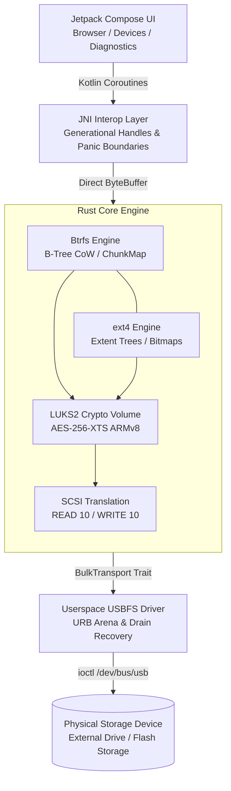

<div align="center">

<!-- Demonstration banner / social preview placeholder -->
<!--  -->

<h1>LUKS-Android &middot; Userspace Storage Stack</h1>

<p><strong>A rootless, high-performance storage and cryptographic stack for Android.</strong><br/>
Pure userspace LUKS2 decryption, ext4, and Btrfs filesystem drivers over Android USB Host APIs. Zero root, zero kernel modules, fail-closed safety.</p>

<a href="https://github.com/rDelmotra/luks-android/releases/latest"></a>
<a href="https://github.com/rDelmotra/luks-android/releases"></a>
<a href="https://github.com/rDelmotra/luks-android/stargazers"></a>
<a href="LICENSE"></a>

<br/><br/>

<strong><a href="#quickstart">Quickstart</a> &nbsp;&middot;&nbsp; <a href="#features">Features</a> &nbsp;&middot;&nbsp; <a href="#how-to-use">How to use</a> &nbsp;&middot;&nbsp; <a href="#architecture">Architecture</a> &nbsp;&middot;&nbsp; <a href="#benchmarks">Benchmarks</a> &nbsp;&middot;&nbsp; <a href="#build-from-source">Build from source</a> &nbsp;&middot;&nbsp; <a href="#testing--verification">Verification</a></strong>

</div>

> [!NOTE]
> **Zero root required.** Android does not provide native kernel drivers for Btrfs, ext4, or LUKS2-encrypted external drives. LUKS-Android bypasses this restriction by implementing the entire cryptographic transform, SCSI translation, and filesystem engines in userspace via Android's USB Host API (`/dev/bus/usb`).

---

## What is LUKS-Android?

**LUKS-Android is an open-source userspace driver and filesystem explorer that lets Android devices unlock, read, and write LUKS-encrypted drives formatted with Btrfs or ext4.** Plug any standard encrypted USB-OTG drive or external storage device into an Android phone or tablet, grant USB access, enter the passphrase, and browse the filesystem directly.

Traditional solutions require rooting the Android device, installing custom kernels, or cross-compiling kernel modules (`dm-crypt`, `btrfs.ko`). LUKS-Android moves the entire stack into an unprivileged userspace process. A high-performance Rust core handles cryptographic decryption and B-tree operations, while a modern Jetpack Compose UI provides intuitive directory browsing, file transfers, and diagnostics.

<div align="center">
<!-- Demonstration screenshot / recording placeholder -->
<!--  -->
</div>

---

## Quickstart

**[⬇ Download the latest release](https://github.com/rDelmotra/luks-android/releases/latest)** — grab `luks-android-v0.1.0-arm64.apk` directly, no build required. Requires Android 10+ (API 29) on an arm64-v8a device.

| Target | Artifact | Size | Description |
| :--- | :--- | :--- | :--- |
| **Android Release (Recommended)** | [`luks-android-v0.1.0-arm64.apk`](https://github.com/rDelmotra/luks-android/releases/latest) | `~3.5 MB` | Prebuilt, ready to install |
| **Android Debug** *(build from source)* | `app-debug.apk` | `~31 MB` | For development and live diagnostics |
| **Native Core (Rust crate)** | `luks_core` / `luks_jni` | `< 2 MB` | Use the engine standalone via Rust or JNI |

### Install via ADB

```bash
# Download luks-android-v0.1.0-arm64.apk from the Releases page above, then:
adb install -r luks-android-v0.1.0-arm64.apk

# Or, after building the release APK from source yourself (see below):
adb install -r android/app/build/outputs/apk/release/app-release-unsigned.apk
```

> [!TIP]
> No ADB? Open the [release APK link](https://github.com/rDelmotra/luks-android/releases/latest) directly on the Android device, download it, and tap the file to install. You'll need to allow "Install unknown apps" for whichever app you downloaded it with (Chrome, Files, etc.) — Android will prompt for this automatically on first install.

---

## How to use

1. **Connect the drive.** Plug a USB-OTG drive or external enclosure into the Android device.
2. **Grant USB permission.** Accept the standard Android USB Host dialog to allow userspace communication via `/dev/bus/usb`.
3. **Unlock the volume.** Enter the passphrase to decrypt the LUKS2 keyslot (Argon2id or PBKDF2).
4. **Browse and transfer.** Explore folders, view file metadata, stream media, or import/export files directly to internal storage.

---

## Features

- **Rootless operation.** Runs entirely in unprivileged userspace using Android's USB Host APIs. No root access, unlocked bootloaders, or custom ROMs required.
- **LUKS2 container cryptography.** Full support for Argon2id and PBKDF2 key derivation functions with AES-256-XTS ciphers, hardware-accelerated via ARMv8 crypto extensions (`pmull`, `aes`).
- **Memory security and key zeroization.** Master keys, subkeys, and expanded cipher schedules implement `Zeroize` and `ZeroizeOnDrop`, purging sensitive material from memory immediately upon exit.
- **Btrfs filesystem engine.** Complete B-tree Copy-on-Write (CoW) mutation engine, live Castagnoli CRC32c checksum calculations, dynamic multi-gigabyte chunk allocation, and subvolume navigation.
- **Transparent decompression.** Reads compressed Btrfs extents on-the-fly supporting Zstandard (zstd), LZO, and Zlib algorithms.
- **ext4 filesystem engine.** Extent tree traversals, directory hash-tree indexing, and block group bitmap allocations, validated against reference Linux `e2fsck`.
- **SCSI Bulk-Only Transport (BOT).** Custom userspace USBFS engine driving 128 KiB chunked SCSI transfers with a non-blocking URB arena and generational drain recovery.
- **Fail-closed safety model.** Release builds enforce compile-time write gating (`dangerous-write-support`). Any transport stall, cable disconnect, or corruption fences the session instantly.
- **Lightweight footprint.** Complete Android application is under 3.5 MB, with no bloated third-party UI libraries.
- **In-memory forensic ring buffer.** A 256-slot non-allocating circular ring buffer records hardware events, SCSI CDBs, sense codes, and filesystem operations with zero plaintext leakage.

---

## Architecture

The system is structured as a 5-layer pipeline connecting Jetpack Compose down to physical USB endpoints:



| Layer | Component | Responsibility |
| :--- | :--- | :--- |
| **Presentation** | Android Jetpack Compose | Modern UI handling device attach events, directory browsing, file transfers, and real-time session state. |
| **Bridge** | JNI Interop Layer | Translates Kotlin calls to Rust, enforces panic barriers, and exposes zero-copy `DirectByteBuffer` buffers. |
| **Filesystems** | Btrfs & ext4 Engines | Parses and mutates filesystem structures, handles inode resolution, extent mapping, and directory indexing. |
| **Cryptography** | LUKS2 Crypto Layer | Decrypts volume headers, parses JSON metadata, derives master keys, and performs hardware-accelerated AES-XTS transforms. |
| **Transport** | Userspace USBFS Driver | Issues low-level SCSI commands (INQUIRY, READ 10, WRITE 10) directly over `/dev/bus/usb` ioctls with robust retry logic. |

---

## Hardware Benchmarks

Measured on physical ARM64 hardware (Android 14+):

| Benchmark Setup | Raw Read | App Export | App Import | Unlock Latency |
| :--- | :---: | :---: | :---: | :---: |
| **Rig A:** Commodity USB 3.2 Gen 1 (OTG) | `29.8 MiB/s` | `21.2 MiB/s` | `6.2–7.4 MiB/s` * | `~1.8 s` *(Argon2id, 256 MiB)* |
| **Rig B:** High-Speed NVMe Storage (USB-C) | `108.7 MiB/s` | `96.5 MiB/s` | `75.0–90.0 MiB/s` | `~6.7 s` *(Argon2id, 1 GiB)* |

> [!NOTE]
> *Write throughput on Rig A is limited by the physical flash write characteristics and pSLC cache exhaustion common on commodity USB thumb drives (~7–10 MB/s sustained flash write).

---

## Feature Support Matrix

| Feature | Read | Write | Implementation Status |
| :--- | :---: | :---: | :--- |
| **LUKS2 (Argon2id & PBKDF2)** | Supported | Supported | Full keyslot parsing, header validation, and key derivation |
| **ext4** | Supported | Supported | Extent trees, directory indexing, block group management |
| **Btrfs (Single device)** | Supported | Supported | Dynamic chunk allocation, B-tree transactions, and CRC32c verification |
| **Btrfs Subvolumes** | Supported | Refused (Fail-closed) | Subvolume writes refused by design to prevent cross-tree mismatches |
| **Btrfs Reflink Deletion** | Supported | Supported | Reflink-safe extent pruning preserving shared extents |
| **Btrfs Compression** | Supported | Planned | ZSTD, LZO, and ZLIB decompression supported; write compression deferred |
| **Btrfs Multi-device (RAID)** | Refused | Refused | Fail-closed refusal to protect multi-device arrays on mobile |
| **SAF DocumentsProvider** | Supported | Planned | Exposes storage to Android system file pickers (Read-only) |

---

## Build from source

### Prerequisites

1. **Rust Toolchain (1.80+)**: `rustup target add aarch64-linux-android`
2. **Android NDK**: NDK r25c or newer (set `ANDROID_NDK_HOME`).
3. **Android SDK**: Build tools 34.0.0+, JDK 17+.
4. **Colima / Docker** *(Optional)*: Required to run Linux kernel-graded oracle validation tests.

### 1. Compile the Native Android Library (`libluks_jni.so`)

The cryptographic and filesystem engine compiles to an arm64 shared library:

```bash
# Safe, Read-Only Default Build
./tools/build-android-libs.sh

# Write-Enabled Testing Build
./tools/build-android-libs.sh --write
```

### 2. Build the Android Application

```bash
cd android

# Production Release Build (~3.5 MB, R8-optimized)
./gradlew assembleRelease
# Output: app/build/outputs/apk/release/app-release-unsigned.apk

# Debug Build (Fast local compilation with debug tracing)
./gradlew assembleDebug
# Output: app/build/outputs/apk/debug/app-debug.apk
```

---

## Testing & Verification

Correctness is validated against official Linux kernel implementations in automated test suites:

### 0. Generate Local Test Fixtures
Only lightweight headers and trace fixtures are stored in the repository. Full disk and filesystem images are generated locally:
```bash
# See detailed per-platform commands in:
cat tools/README-fixtures.md
```

### 1. Workspace Unit & Integration Tests
```bash
cargo test --workspace
cargo test --workspace --features luks_core/dangerous-write-support,luks_jni/dangerous-write-support
```

### 2. Linux Kernel Oracle Graded Suite
```bash
tools/test-graded.sh --workspace --features luks_core/dangerous-write-support,luks_jni/dangerous-write-support
```

### 3. Write-Path Safety Gate
Verifies that release builds contain zero write symbols or entry points:
```bash
bash tools/verify-no-write-code.sh
```

### 4. Android Unit Tests
```bash
cd android && ./gradlew testDebugUnitTest
```

---

## Diagnostic Logging

The engine includes a 256-slot non-allocating circular memory buffer that tracks USB transfer submissions, reaps, SCSI CDBs, sense codes, and filesystem events.

Extract the live forensic ring buffer via ADB:

```bash
# Trigger an immediate forensic dump to Android logcat
adb shell am broadcast -a dev.luksandroid.DUMP_FORENSIC

# Inspect the structured trace output
adb logcat -d -s LUKS_FORENSIC_DUMP:I
```

*The diagnostic trace logs timing, SCSI status codes, and recovery states while strictly omitting any user data or filenames.*

---

## Security & Safety

- **No Plaintext Logging:** Passphrases, derived keys, and directory contents are never written to disk, Android logcat, or diagnostic buffers.
- **Immediate Memory Purging:** Cryptographic secrets implement `ZeroizeOnDrop`, clearing backing memory buffers as soon as an operation finishes.
- **Fail-Closed Default:** If a USB transfer stalls, a device disconnects unexpectedly, or an inconsistent filesystem state is detected, the driver halts immediately to prevent data loss.

---

## Contributing

Contributions, bug reports, and discussions are welcome:
- Review [CONTRIBUTING.md](CONTRIBUTING.md) and [CODE_OF_CONDUCT.md](CODE_OF_CONDUCT.md).
- Open issues with complete hardware details, kernel versions, and ADB diagnostic logs.
- Security disclosures: please review [SECURITY.md](SECURITY.md).

---

## License

Created and maintained by **Rehaan Delmotra**.

Licensed under the **[MIT License](LICENSE)**.
