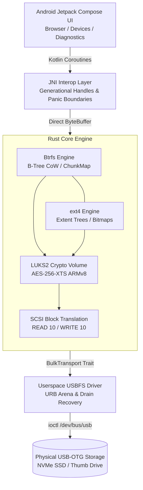

<div align="center">
  
  # 🛡️ LUKS-Android
  **A rootless, high-performance userspace storage stack for Android.**
  
  [](LICENSE)
  [](https://www.rust-lang.org/)
  [](https://developer.android.com)
  []()
  []()

</div>

<br/>

Android lacks native support for Btrfs, ext4, and LUKS-encrypted drives—typically requiring a rooted device and custom kernel modules. **LUKS-Android** completely bypasses these limitations by implementing a full storage and cryptographic stack directly in unprivileged userspace, communicating with USB-OTG drives via Android's USB Host APIs.

<details>
<summary>📋 Table of Contents</summary>

- [✨ Highlights & Features](#-highlights--features)
- [🏗️ System Architecture](#️-system-architecture)
- [📊 Performance & Benchmarks](#-performance--benchmarks)
- [🛠️ Getting Started](#️-getting-started)
  - [Prerequisites](#prerequisites)
  - [Building from Source](#building-from-source)
- [🧪 Testing & Verification](#-testing--verification)
- [🔍 Diagnostic Logging](#-diagnostic-logging)
- [⚙️ Feature Matrix](#️-feature-matrix)
- [🔐 Security & Privacy](#-security--privacy)
- [📜 License](#-license)

</details>

---

## ✨ Highlights & Features

- **Zero Root Required:** Runs entirely in unprivileged Android userspace via `/dev/bus/usb`. No root, no kernel modules, no custom ROMs.
- **LUKS2 Cryptography:**
  - Full support for **Argon2id** and **PBKDF2** key derivation functions.
  - AES-256-XTS cryptographic engine, massively accelerated by ARMv8 Cryptography Extensions (`pmull`, `aes`).
  - **Strict Key Hygiene:** Master keys and expanded cipher schedules are scrubbed securely from memory on drop via `zeroize`.
- **Advanced Btrfs Engine:**
  - Complete B-tree traversal and Copy-on-Write (CoW) node mutation engine.
  - Live CRC32c Castagnoli checksum calculation and on-the-fly checksum tiling.
  - Dynamic chunk allocation: Scales seamlessly from megabytes to multi-gigabytes without pre-allocation limits.
  - Atomic two-phase commits with superblock generation stamping for robust crash resilience.
  - Empty-root self-healing, leaf pruning, and shared-extent protection (`cp --reflink` safe).
- **ext4 Engine:**
  - Extent tree allocations, directory indexing, and block group bitmap management. Formally oracle-verified against Linux `e2fsck`.
- **Bulletproof USB Transport (BOT):**
  - Custom userspace USBFS driver implementing the SCSI Bulk-Only Transport (BOT) protocol.
  - Non-blocking URB arena management with generation tracking to prevent use-after-free conditions and driver stalls.
  - Capable of sustaining hardware-saturating speeds using 128 KiB chunked SCSI transfers.
- **Fail-Closed Safety Architecture:**
  - **Compile-time write gating** (`dangerous-write-support`): Release default builds contain **zero** write opcodes in the binary.
  - Any transport failure, USB stall, or filesystem corruption instantly fences the write session to prevent cascaded drive damage.

---

## 🏗️ System Architecture

LUKS-Android is built as a 5-layer stack bridging the Jetpack Compose UI all the way down to physical block addressing over USB:



---

## 📊 Performance & Benchmarks

Measured on physical hardware (Pixel 8 running Android 14+):

| Benchmark Setup | Raw Read | App Export | App Import | Unlock Latency |
|:---|:---:|:---:|:---:|:---:|
| **Rig A:** SanDisk Ultra USB 3.2 Gen 1 (OTG) | `29.8 MiB/s` | `21.2 MiB/s` | `6.2–7.4 MiB/s` * | `~1.8 s` *(Argon2id, 256 MiB)* |
| **Rig B:** RTL9210 NVMe M.2 Enclosure (USB-C) | `108.7 MiB/s` | `96.5 MiB/s` | `75.0–90.0 MiB/s` | `~6.7 s` *(Argon2id, 1 GiB)* |

> [!NOTE]
> *Write throughput on Rig A is strictly bottlenecked by the physical TLC flash write speeds and pSLC folding characteristics of commodity USB thumb drives (~7–10 MB/s sustained flash write).*

---

## 🛠️ Getting Started

### Prerequisites

Ensure you have the following installed and configured:
1. **Rust Toolchain (1.80+)**: `rustup target add aarch64-linux-android`
2. **Android NDK**: NDK r25c or newer (export `ANDROID_NDK_HOME`).
3. **Android SDK**: Build tools 34.0.0+, JDK 17+.
4. **Colima / Docker** *(Optional)*: Required to run Linux kernel-graded validation suites.

### Building from Source

#### 1. Compile the Native Android Library (`libluks_jni.so`)

The driver logic is compiled into a shared library. For safety, the default build is **read-only**:

```bash
# Default Safe (Read-Only) Build
./tools/build-android-libs.sh

# Write-Enabled Testing Build
./tools/build-android-libs.sh --write
```

#### 2. Build and Install the App

Navigate to the `android/` directory to build the APK:

```bash
cd android
./gradlew assembleDebug

# Install directly to a connected device
adb install -r app/build/outputs/apk/debug/app-debug.apk
```

---

## 🧪 Testing & Verification

The testing framework enforces strict correctness. Tests are graded against an actual Linux kernel running in a virtual environment, checking filesystem mounts and executing `btrfs check`, `btrfs scrub`, and `e2fsck`.

**1. Workspace Unit & Integration Tests**
```bash
cargo test --workspace
cargo test --workspace --features luks_core/dangerous-write-support,luks_jni/dangerous-write-support
```

**2. Kernel-Graded Oracle Test Suite**
```bash
tools/test-graded.sh --workspace --features luks_core/dangerous-write-support,luks_jni/dangerous-write-support
```

**3. Write-Path Safety Gate**
Ensures release artifacts cannot inadvertently include write opcodes:
```bash
bash tools/verify-no-write-code.sh
```

**4. Android Unit Tests**
```bash
cd android && ./gradlew testDebugUnitTest
```

---

## 🔍 Diagnostic Logging

The engine maintains a 256-slot non-allocating circular memory buffer capturing low-level USB submits, reaps, SCSI CDBs, sense bytes, and filesystem events.

Extract the live forensic ring buffer via ADB:

```bash
# Trigger an immediate forensic dump to logcat
adb shell am broadcast -a dev.luksandroid.DUMP_FORENSIC

# Inspect the logcat trace
adb logcat -d -s LUKS_FORENSIC_DUMP:I
```

*The dump contains timestamps, CDB opcodes, return statuses, and generation counts without logging any plaintext user data or filenames.*

---

## ⚙️ Feature Matrix

| Feature | Read | Write | Notes |
|:---|:---:|:---:|:---|
| **LUKS2 (Argon2id & PBKDF2)** | ✅ | ✅ | Full keyslot & header validation |
| **ext4** | ✅ | ✅ | Directory indexing, extent trees |
| **Btrfs (Single device)** | ✅ | ✅ | Dynamic chunk allocation, CoW B-trees |
| **Btrfs Subvolumes** | ✅ | ⚠️ | Read-only subvolumes are enforced fail-closed |
| **Btrfs Reflink Deletion** | ✅ | ✅ | Preserves shared extents (`refs > 1`) |
| **Btrfs Compression** | ✅ | ❌ | Decompression (ZSTD/LZO/ZLIB) supported. Write compression deferred. |
| **Btrfs Multi-device (RAID)** | ❌ | ❌ | Fail-closed refusal for mobile safety |
| **SAF DocumentsProvider** | ✅ | ❌ | Exposes files to Android's "Files" app (Read-only) |

---

## 🔐 Security & Privacy

- **No Plaintext Leaks:** Passwords, key material, and user filenames are never formatted into standard logs, ring buffers, or crash dumps.
- **Key Zeroization:** Sensitive cryptographic structures implement `Zeroize` and `ZeroizeOnDrop` to purge cryptographic material from memory the moment it leaves scope.
- **Immutable Release Builds:** By default, the application is compiled completely devoid of write capability. Write operations must be explicitly enabled at compile time.

---

## 📜 License

This project is licensed under the **[MIT License](LICENSE)**.
