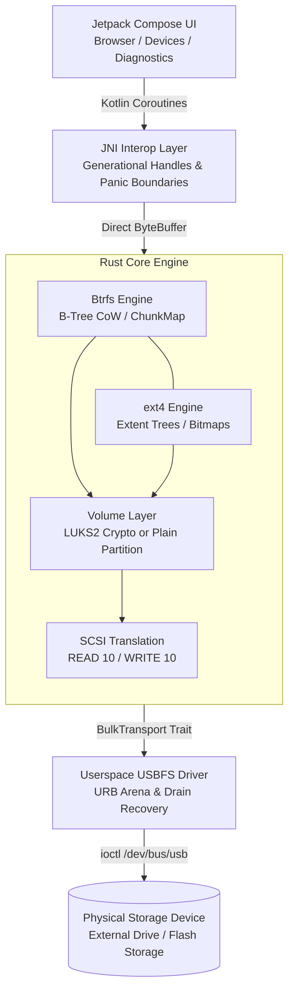

# Architecture

The system is structured as a 5-layer pipeline connecting Jetpack Compose down to physical USB endpoints:

| Layer | Component | Responsibility |
| :--- | :--- | :--- |
| **Presentation** | Android Jetpack Compose | Modern UI handling device attach events, directory browsing, file transfers, and real-time session state. |
| **Bridge** | JNI Interop Layer | Translates Kotlin calls to Rust, enforces panic barriers, and exposes zero-copy `DirectByteBuffer` buffers. |
| **Filesystems** | Btrfs & ext4 Engines | Parses and mutates filesystem structures, handles inode resolution, extent mapping, and directory indexing. |
| **Volume & Crypto** | LUKS2 & Plain Volume Layer | Decrypts LUKS2 containers (AES-256-XTS) or mounts unencrypted plain partitions with boundary clamping. |
| **Transport** | Userspace USBFS Driver | Issues low-level SCSI commands (INQUIRY, READ 10, WRITE 10) directly over `/dev/bus/usb` ioctls with robust retry logic. |

---

## Hardware Benchmarks

Measured on physical ARM64 hardware (Android 14+):

| Benchmark Setup | Raw Read | App Export | App Import | Unlock Latency |
| :--- | :---: | :---: | :---: | :---: |
| **Rig A:** Commodity USB 3.2 Gen 1 (OTG) | `29.8 MiB/s` | `21.2 MiB/s` | `6.2–7.4 MiB/s` * | `~1.8 s` *(Argon2id, 256 MiB)* |
| **Rig B:** High-Speed NVMe Storage (USB-C) | `108.7 MiB/s` | `96.5 MiB/s` | `75.0–90.0 MiB/s` | `~6.7 s` *(Argon2id, 1 GiB)* |

> [!NOTE]
> *Write throughput on Rig A is limited by the physical flash write characteristics and pSLC cache exhaustion common on commodity USB thumb drives (~7–10 MB/s sustained flash write).

---

## Feature Support Matrix

| Feature | Read | Write | Implementation Status |
| :--- | :---: | :---: | :--- |
| **LUKS2 (Argon2id & PBKDF2)** | Supported | Supported | Full keyslot parsing, header validation, and key derivation |
| **Plain Volumes (non-LUKS)** | Supported | Supported | 7-point superblock detection, bounded I/O, per-session write confirmation |
| **ext4** | Supported | Supported | Extent trees, directory indexing, block group management |
| **Btrfs (Single device)** | Supported | Supported | Dynamic chunk allocation, B-tree transactions, Free-Space Tree CoW, CRC32c |
| **Btrfs Subvolumes** | Supported | Supported | Single-tree encapsulation, extent backrefs, and packed checksum trimming |
| **Btrfs Reflink Deletion** | Supported | Supported | Reflink-safe extent pruning preserving shared extents |
| **Btrfs Compression** | Supported | Planned | ZSTD, LZO, and ZLIB decompression supported; write compression deferred |
| **Btrfs Multi-device (RAID)** | Refused | Refused | Fail-closed refusal to protect multi-device arrays on mobile |
| **SAF DocumentsProvider** | Supported | Planned | Exposes storage to Android system file pickers (Read-only) |

> [!NOTE]
> This matrix describes the capabilities implemented on `main` and shipped in the `v0.2.0` release. Release builds include compile-time write safety assertions (`checkNoWriteCodeInRelease`) that require `-PallowWriteInRelease=true` when native write support is compiled in.
